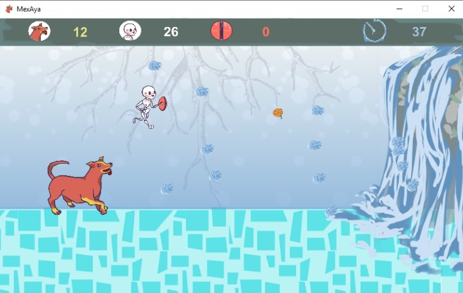
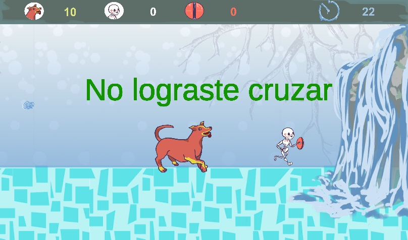

# MexAya
Un sitio web y un videojuego inspirados en la cultura mexicana y el día de muertos para su desarrollo. Utilizando el motor de Unity 3D y los servicios en la nube de Azure tales como QnA, Machine Learning y sAzure Web Sites en conjunto con Wordpress. 

*Un proyecto creado para Inovaccion Virtual Hackathon 2020 con el objetivo de dar a conocer el día de muertos y la cultura mexicana.*

## Página web con Wordpress y Azure Web Sites
Alojando a MexAya-Bot, más  información y contenido multimedia sobre el proyecto MexAya y leyendas interesantes de México.

## Base de conocimiento QnA y chat
Pregúntale a MexAya-Bot y ten conversaciones tanto divertidas como eriquecedoras. Un poco de conocimiento sobre lo que quieras saber del día de muertos y el folklor de México.

## Videojuego con Unity 3D
Para atravesar el inframundo necesitas de la compañía de Xolo para cruzar, sin embargo, debes usar tu escudo para defenderte a ti y a Xolo de los obstáculos. ¡La durabilidad del escudo se debilita con cada ataque que defiendes! Pero puedes recuperarla recogiendo las flores de Cempaxúchitl en el camino. Puedes resistir hasta que la cuenta atrás termine? 

## Videojuego con P5 y Machine Learning para comandos de voz
Juego 2D programado con JS además haciendo uso de las librerías de Machine Learning para acciones con comandos de Voz.

------------

A Web Site and a videogame developed inpired in Mexican culture and the day of the dead, using Unity 3d and Azure services such as QnA, Machine Learning and Azure Web Sites through Wordpress. A project created for Inovaccion Virtual Hackathon 2020 in order to make the day of the dead and Mexican culture more known.  

